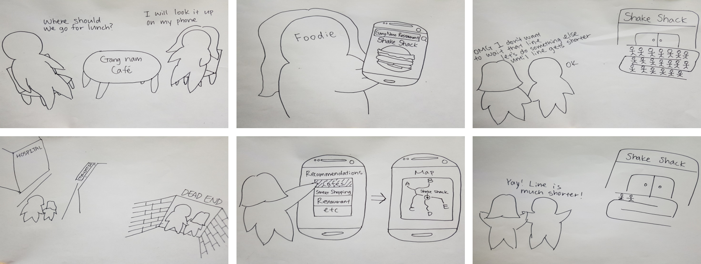

**CS374 Design Project 2: Ideation** 
**Team JEONSSA**
20111016 Min Kang  
20121059 SunJae Lee  
20121061 Joon Young Lee  
20121087 Sewon Hong

---

# Ideation
 
 
## Point of view
We met a restaurant owner. 
We were amazed to realize that two in one customers left because of waiting. 
It’d be game-changing to drastically reduce the time customers have to wait.

## Persona
 
 
* Nubjjugi is a restaurant owner
* His situated in busy area, usually always full during busy hours
* Many customers have to wait
* Loses lots of potential business to waiting customers
* Has limited space available in dining area

### Nubjjugi’s Goals:
	1) Reduce customers’ waiting time
	2) Serve as many customers as possible
 

## How Might We (HMW) Questions
How might we...
...encourage customers to eat faster?
...make use of all available tables (space)?
...make waiting time more productive?

## Solution Ideas

### Encourage faster eating
1. s
2. s
3. s

### Make use of space
1. remove table(sit on the floor)
2. let customer eat while standing
3. use food-truck in busy hour

### Productive waiting time
1) as
2) asd
3) as

## Top 3 Solutions
### Solution 1: Share Table
How?
Make full use of available seats in the restaurant
Why?
Waste of available dining area space, 
benefits customer by removing waiting their time

### Solution 2: Give Incentives to Fast Eaters
How?
Ideation on HMW encourage customers to eat faster? We voted for the best.
Why?
Better than giving disadvantage to slow eaters.
(To encourage people to eat fast so that fewer people have to wait)

### Solution 3 : Recommend Entertainment
How?
Make use of available sources near the restaurant
Why?
People visiting restaurants in an unfamiliar region don’t have info, 
so reduce the time searching for info and get right into entertainment

## Storyboards
### Storyboard 1
 
 
 
### Storyboard 2
 
 
 
 ### Storyboard 3
 
