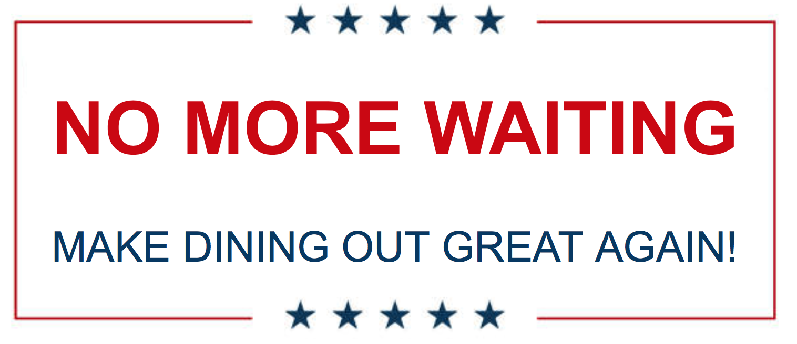
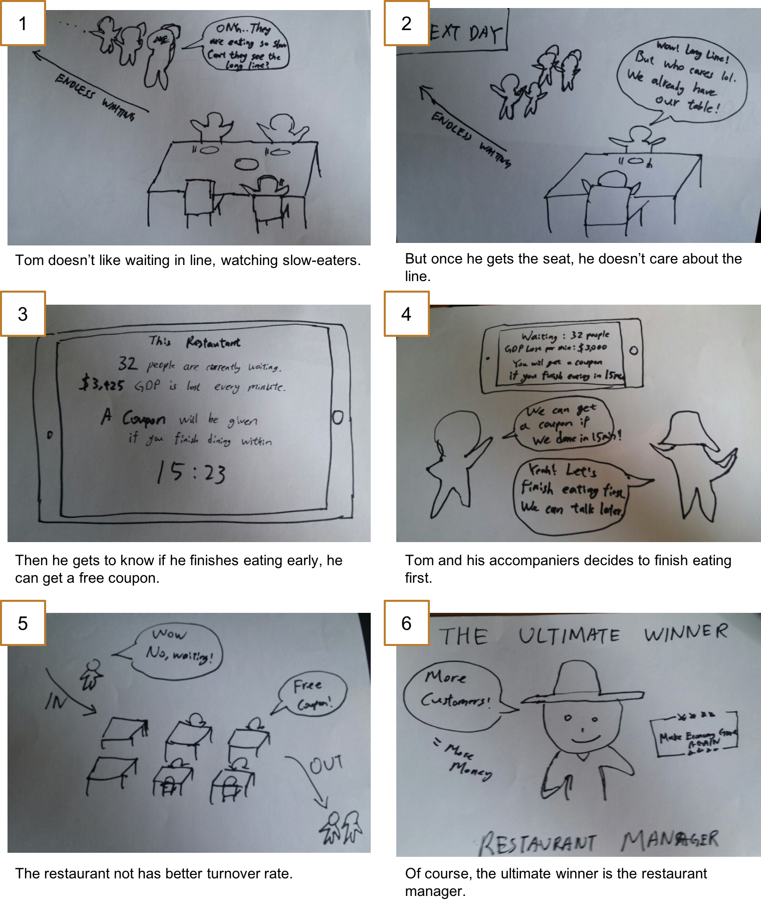
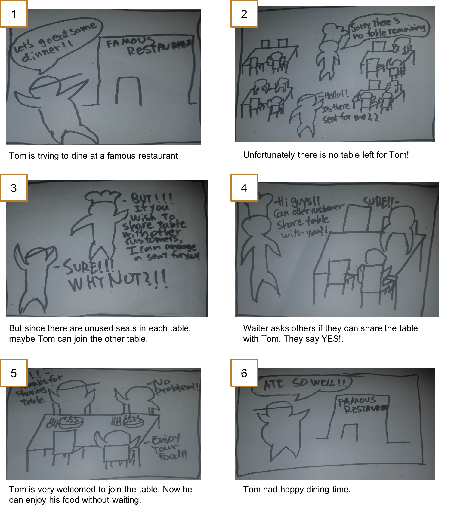
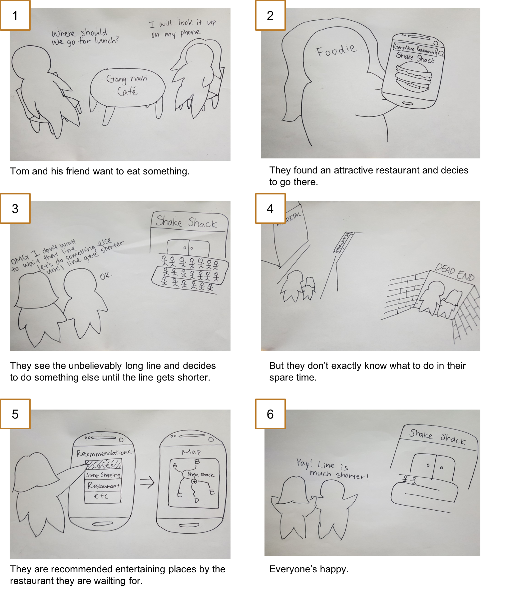

**CS374 Design Project 2: Ideation**  
**Team JEONSSA**  
20111016 Min Kang  
20121059 SunJae Lee  
20121061 Joon Young Lee  
20121087 Sewon Hong

---

# Ideation
 
 
## Point of view
	We met a restaurant owner.  
	We were amazed to realize that one out of two customers leaves because of waiting.  
	It’d be game-changing to drastically reduce the time customers have to wait.

## Persona
 
 
* Age: 42
* Occupation: Restaurant Owner
* Status: Married
* Location: Gangnam, Korea
* beliefs: Providing good foods to customers is the only way to succeed.
* motivation: Achievement, complement, incentive
* preference: He prefers being busy than free

### Nubjjugi’s story:
	* Nubjjugi is a 42 years old restaurant owner
	* His restaurant is in busy area of Gangnam, usually always full during busy hours
	* Many customers have to wait for his restaurant. 
	* His restaurant has limited space available in dining area
	* Loses lots of potential business to waiting customers
	* He wants to minimize the number of waiting customers, so that he can reduce the lose of potential business

### Nubjjugi’s Goals:
	1) Reduce customers’ waiting time
	2) Serve as many customers as possible
 

## How Might We (HMW) Questions
	1. encourage customers to eat faster?
	2. make use of all available table (space)?
	3. make waiting time more productive?
	4. provide estimated waiting time for customers?
	5. keep track of waiting customers?
	6. manage no showers?
	7. reduce the waiting time?
	8. serve foods faster?
	9. 
	10. as
	11. as
	12. as

### Top 3 HMW
Selection Process: We selected top 3 by. 
#### How might we...   
	1. encourage customers to eat faster?  
	2. make use of all available tables (space)?  
	3. make waiting time more productive?  

## Solution Ideas

### Encourage faster eating
	1. make slow eater to pay more
	2. fixed eating time constraint
	3. give discounts to fast eater
	4. give coupons to fast eater
	5. give desserts to fast eater
	6. slow eaters get less amount of food
	7. different cost assigned to differing eating time
	8. forbid doing other things besides eating
	9. customers can use table only if their food is ready
	10. Make fast eating rank tournament

### Make use of space
	1. remove table(sit on the floor)
	2. let customer eat while standing
	3. use food-truck in busy hour
	4. let customers join table
	5. move kitchen to another floor or other building
	6. implement take-outs
	7. implement delivery system
	8. make tables outside the restaurant
	9. customers can use table only if their food is ready
	10. extend restaurant

### Productive waiting time
	1. remove waiting time completely
	2. discount depending on time customer had to wait
	3. customer prepares own food
	4. give incentive if waiting is long
	5. discount next time when customer doesn’t get to eat this time
	6. advertise restaurant on sns and get free food
	7. recommend other restaurant
	8. customer prepares food ingredients
	9. provide entertainment(e.g. movie, show) to customers waiting
	10. make partnership with nearby entertainment place. (e.g. cafe, pc cafe)

## Top 3 Solutions  
Selection Process: Ideation on each HMW questions. Then we voted for the best. 
### Solution 1: Give Incentives to Fast Eaters
	Why? Better than giving disadvantage to slow eaters.  
	(To encourage people to eat fast so that fewer people have to wait). 

### Solution 2: Share Table
	Why? Tthis solution is very practical, and costs nothing. Very high effeciency.  

### Solution 3: Recommend Entertainment
	Why? People visiting restaurants in an unfamiliar region don’t have info, so reduce the time searching for info and get right into entertainment so reduce the time searching for info and get right into entertainment

## Storyboards
### Storyboard 1
 
 
 
### Storyboard 2
 
 
 
 ### Storyboard 3
 
 
 
 ## Studio Reflections
	1) group of 3, don't want to share -> owner of restaurant mediates
	2) 일찍 오거나 늦게 오거나 
	3) provide actual waiting time 
	4) 사용자 손해
