**CS374 Design Project 3: Paper Prototyping**  
**Team JEONSSA**  
20111016 Min Kang  
20121059 SunJae Lee  
20121061 Joon Young Lee  
20121087 Sewon Hong

---

# Paper Prototyping
 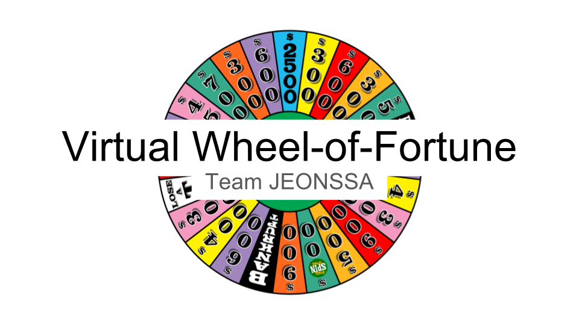
 
---
## Prototype
### Initial Screen
 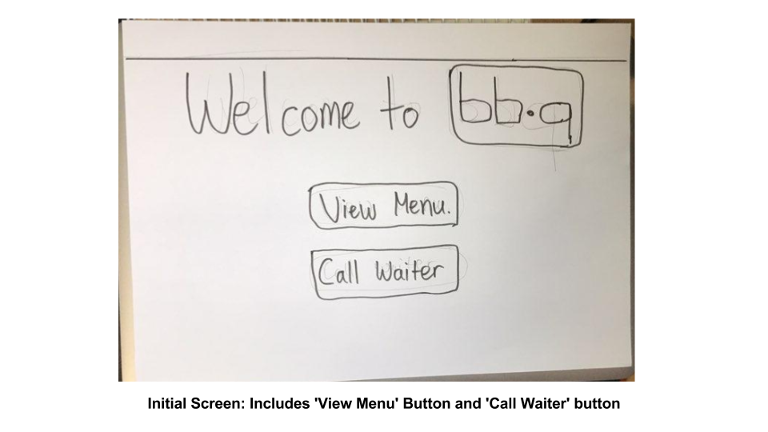
 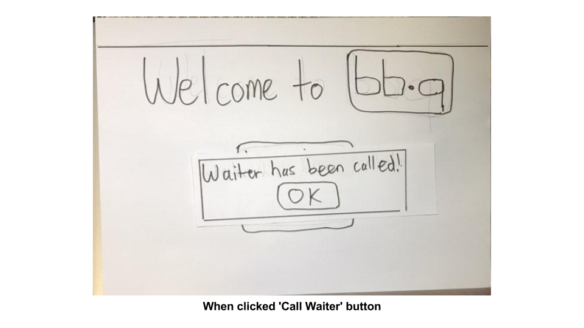
 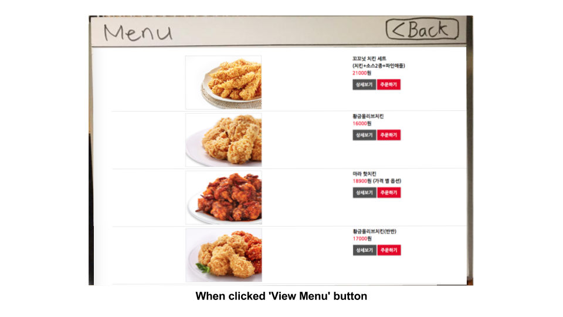

### Surprise Offer Pop-up
 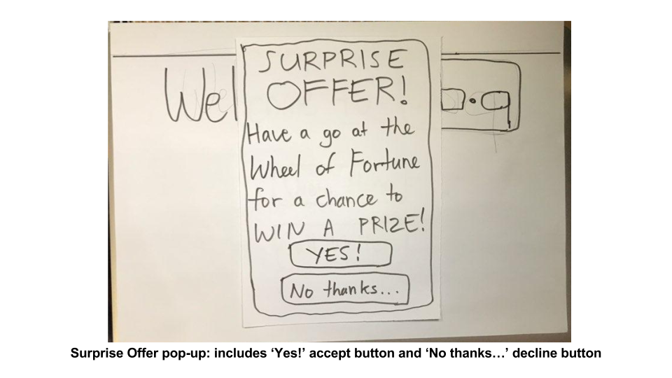
##### Decline Offer
 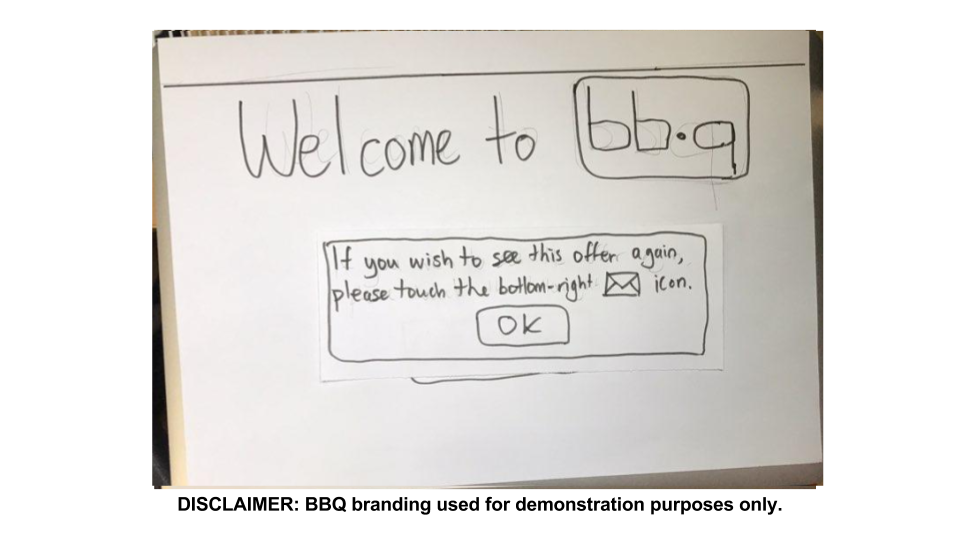
 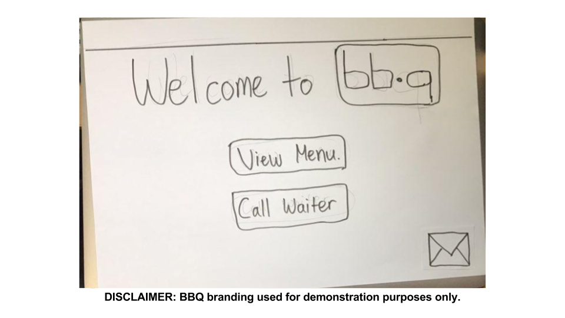
##### Accept Offer
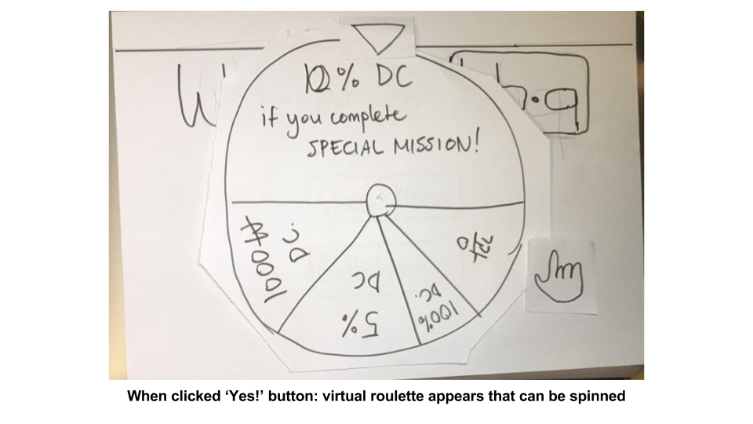
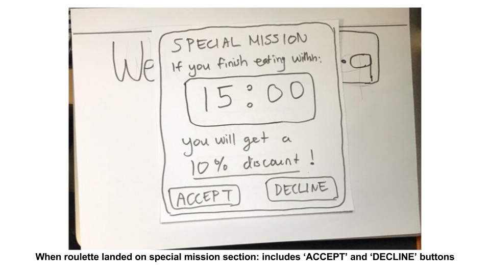
###### Accept mission
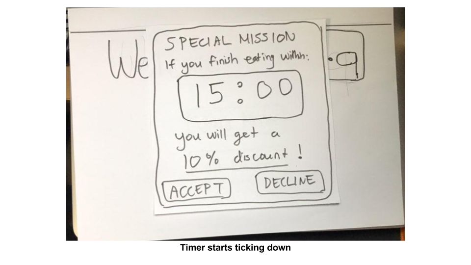
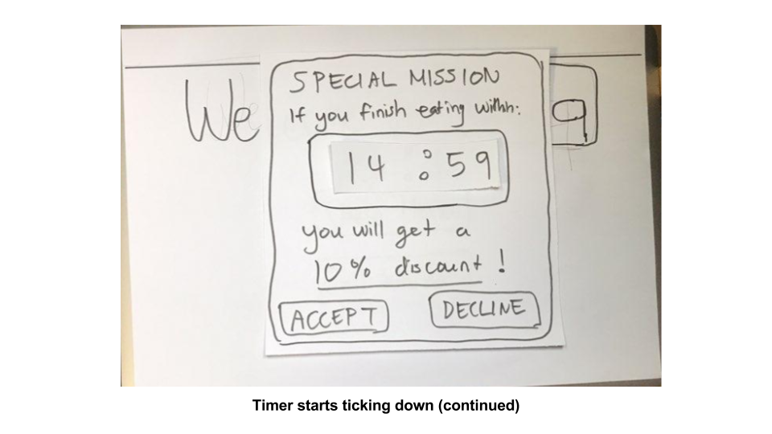
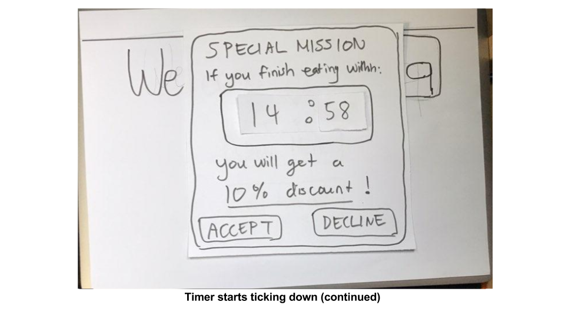
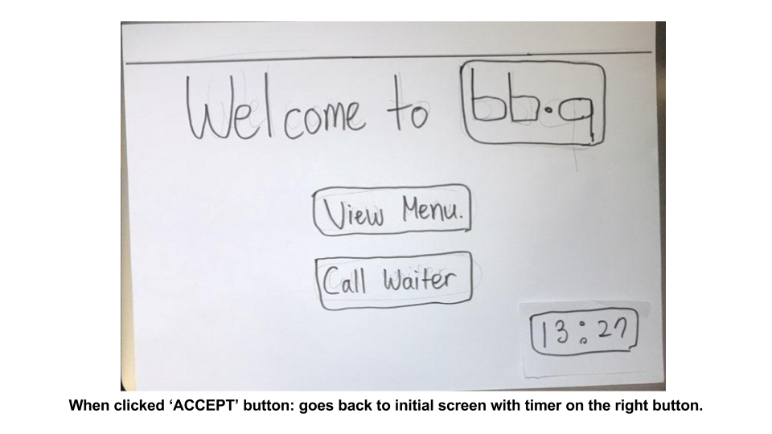
###### Decline mission
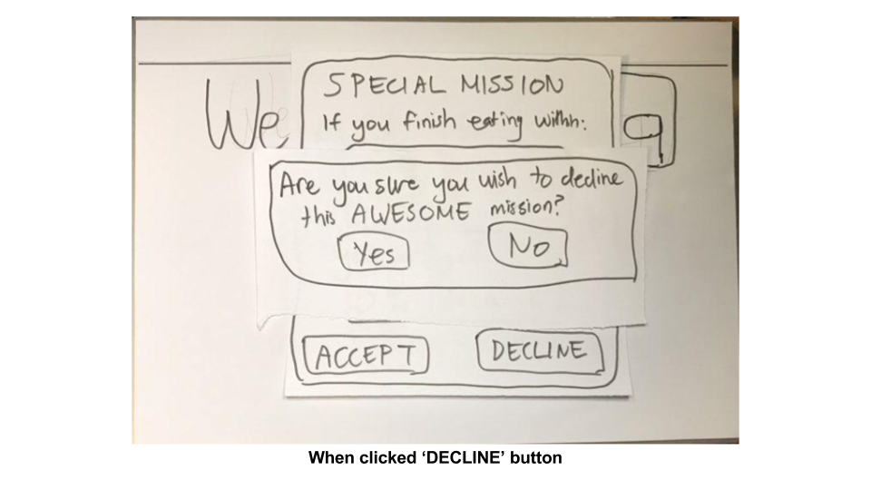
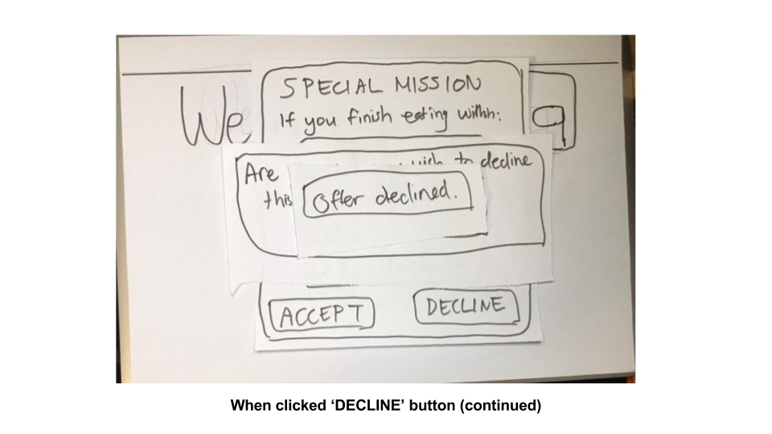

---
## Participants

We presented our prototype to total three participants. 

###### KAIST undergraduate Student
* age: 23
* sex: male
* description: He is a KAIST undergraduate student who often goes out to eat with his girlfirend. Both he and his girlfriend is well known foodie, and has lots of experience waiting in a restaurant

###### SNU grad student
* age: 25
* sex: male
* description: He is a SNU graduate student who lives in very busy area around SNU. He hates waiting in a restaurant, and has has hard time finding restaurant that doesn't requires waiting.

###### OWNER of restaurant at Gangnam.
* age: 43
* sex: male
* description: He is a chief and a owner of a restaurant in a very busy area in Gangnam. He is very concerned about lossing potential users because of waiting time. 
---
## Briefing
Hello, thank you for participating. We are currently trying to redesign how potential customers have to wait for seats in full restaurants during peak hours. We believe one way to enhance the waiting experience is to shorten the expected waiting time. The purpose of this test is to see whether the customer is willing to eat faster if some incentives is given.

Before we precede to testing, please imagine yourself dining at a table in a busy and famous restaurant. And at one side of the table, there is a iPad. Imagine that this paper prototype is the iPad. A prompt will show while you are dining and you will be asked to certain tasks.
  
---
## Tasks
The users performed three main tasks: 
1) Click the accept button for the surprise offer, if they chose to try the roulette, or the dismiss button, should they have chosen not to accept
2) Spin the virtual roulette and get a reward (or possibly none) based on which category the wheel landed on, with the reward automatically taken into account (assuming the restaurant tracks customers and their orders by table)
3) Check the restaurant menu items and prices (and possibly order them directly from the interface?)

---
## Observation

Task | Observation
 --- | --- 
Accept/deny Roulette | 1. Too many pop-ups on a single screen in the last slide. (P1, low)
Spin Roulette | 2. Show roulette is spinnable (P2, high)   3. User can't change decision once declining the roulette offer. (P1, high)   4. Not sure where to see if I(user) have successfully completed the mission. (P1,P2, high)    5. Where and when to get the incentive? (P1,P2, high)
Check menu | 6. Use better example of 'View Menu' screen. 상세보기 주문하기 look like buttons, but they aren't. (P1, high)
Call Waiter | 7. Wants to be notified if waiter is called correctly. (P2, high)
Physical | 8. Tablet takes up too much table space (P3, high)   9. Very high possibility that user won't notice the pop-up if user puts tablet aisde. (P3, medium)
Mental | 10. Psychological pressure due to real time count down - unhealthy. (P1,P2, medium)

### Plans for Improvement (order corresponds to the list in table)
1) In the last prototype slide, consider removing pop-ups behind offer declined.
2) Feedback implemented in current version of prototype with hovering finger icon over the roulette to indicate roulette is spinnable.
3) Feedback implemented in current version of prototype with pop-up alarms stored in buttom right message icon.
4) Add a task that displays mission status.
5) Add a task that tells when and where to receive the incentive.
6) Include interactions with ‘주문하기, 상세보기’ buttons.
7) Feedback implemented in current version of prototype with ‘waiter has been called’ pop-up.
8) Make system compatible with  customer’s phone  to get rid of tablet.
9) Produce bip sound when an pop-up alerts.
10) Get rid of real time count down and tell whether the user has completed the mission or not after finish eating.

---
## Individual Reflection

#### SunJae Lee
**Role: Observer**
What role did you play in each round?
* For each round, I played as an observer. As an observer, I had to remain silent at all time, and take notes of all the actions and thoughts that user performed while testing the prototype. I divided the notes into different sections based on user's action. For example, I had a section called "touching." In this section, I recorded all the "touch" action that user performed, including invalid touch such as touching an unclickable region. Furthermore, whenever user stopped his actions for more than three or more seconds, I categorized such action as "paused" so that we can know where user might have hard time understanding the UI. Any "think aloud" were also categorized into different sections such as "Recommendation," "dislike," "like," and "confused." 

What were some of the difficulties you faced playing the role(s)?
* As an observer, it was very hard to just watch what users were doing. Since observer should remain silent at all time, and simply record users' performance, it was very tempting to correct users' failure. In addition, some users asked me some questions on how this UI wors or how it is supposed to work. I tried to speak absolutely nothing, so it was vey awkward to just ignore users' questions. Also, while taking notes, I wanted to ask users why they performed in such way, but I couldn't because I was an observer.

In what way was paper prototyping useful in your project?
* Paper prototype was very helpful in that it provided users with concrete design and functionality of part of our project. We did not have to think about programming issues or any other implementation issues while building this prototype. Therefore, we were able to more focus on the design and functionality. Also, while building a paper prototype, it was easy to fix, rebuild, and add functionalities or UI. We only had to simply re draw the paper or add something to the paper. Overall, paper prototyping reduced much of our time testing UI and functionalities. 

What did your paper prototype not cover or test?
* Despite all the pros of paper prototype, there are some things that we could not cover or test with paper prototype. Since the pages and pop-ups are visualized manually, we were unable to test whether "surprise offer" is actually surprise to the users. poping up the "surprise offer" page manually was too slow to "surprise" the users. Also, we were not able to test how our implementation actually work on the web browser. since our project is aimed for mobile device, we need to have mobile friendly UI, and user actions that could be done only with one thumb. However in this prototype, we were not able to thest if our implementation if adequet for mobile devices. Furthermore, we had to restrict much of user actions in this prototype. For example, for spinning roulette, we could not make an actual roulette for this prototype, so Joon Young, who took role of computer had to mannually spin the roulette. We weren't able to test if spinning roulette game is actually fun event for the users. 

#### Min Kang
**Role: Observer**

* As an observer, for each round, I took rigorous notes detailing the actions that each user made at certain points in the interface, and how each user differed in actions from one another; also, I detailed how each user succeeded or failed to correctly identify the function of an interface element, and how they dealt with learning and interacting with our prototype interface.  
* Sometimes, the users would not necessarily "think aloud" for all aspects of their actions, leaving me to guess in between the lines of why they did a specific action at a specfic point in time. Also, sometimes users would immediately switch to another action whilst not having completed their previous initiated action, making notetaking hard to follow from time to time.  
* Paper prototyping was incredibly useful in regards to the fact that we could whip out a rough sketch of what we imagined our interface to be like, in an incredibly short span of time; it would have taken much longer to try to implement a computer prototype with a similar degree of finish. We were able to quickly outline different aspects of our interface without much hassle, thanks to the flexibility of being able to present on a paper medium.  
* Our paper prototype, like most paper prototypes, was not able to cover the detailed finish of UI and was not able to exhibit high fidelity in regards to look. Also, for our wheel-of-fortune example, our prototype did not go into exact specifics of the exact time a user would be prompted, or the given probabilities of landing on a certain category when the user would spin the wheel-of-fortune.

#### Joon Young Lee
What role did you play in each round?
* Computer. For each round, I tried to act like a real computer in response to the user's actions. I moved around pieces of paper representing different elements in response to a user pressing buttons. I also made a verbal sound to express the spinning effect of roullete.

What were some of the difficulties you faced playing the role(s)?
* As a computer, I had to think mechanically and mimic how an actual computer would do. Since I know the entire process of our prototype, when the user did not use the entire functions of our prototype I had the temptation to hint the user to proceed to a certain direction so that the user explores our prototype entirely. Another trivial difficulty was that I was unable to simulate the response time of an actual computer; I need to process what the next step is in my head, and my hands are much slower than the computing power of computers. Also, we had many pop-ups and different screens, so it was hard to keep these items in an organized way so that I can instantaneously pick-up an item that corresponds to a user's action. There were simply too many items to keep track of and memorize which function it is related to.

In what way was paper prototyping useful in your project?
* We did not have a concrete idea of how our UI would look like, so in the beginning we just played around with paper prototyping materials, then constituted our first prototype. However, not after long we realized we included features that are abundant or not necessary such as sidebar. Our prototype did not have numerous tasks so the sidebar was actually unnecessary. If we had coded a sidebar in real computer, we would have been reluctant to throw it away because of the amount of time spent to develop a sidebar feature. In this sense, we benefited from paper prototyping as we could different versions and easily throw away features that would take tons of time if it had been coded. Furthermore, we only used a black marker in the entire process and thus we did not waste time in arguing about which feature should be what color. It led us to focus on the big picture of our service.

What did your paper prototype not cover or test?
* Since making everything big is recommended in a paper prototyping, forms such as buttons and textbox were made large and constituted in different layes so that each element looks very distinct. However in real computer, the items will not be as that big and won't be placed in different layers, so we cannot check if the user notices every single element that we implemented. For example, the there is even a slight chance that the user might not notice the message icon that enables the user to see the roulette chance. Moreover, we cannot check the respone time of elements, for example, how long does it take to load the roulette and how long should the roulette be spinning if the user spins the roulette?
#### Sewon Hong

What role did you play in each round?
- Facilitator

What were some of the difficulties you faced playing the role(s)?
- It was not easy to guide the user to "think aloud". One participant was not very talkative and there were intermittently "awkward moments". I had to improvise the sentences, such as "Any feelings about pop-up offer?", so that the participant would speak out what goes inside his head.
- Also, it was hard to decide whether and when to interrupt during the task. I was in between the choices of not interrurpting to see what difficulties the user is experiencing and of interrupting to make the user to "think alound" and keep the user on track of tasks.

In what way was paper prototyping useful in your project?
- Faster to build and Easier to change. We designed our prototype with certain hypothesis in mind. Initially, we thought giving a prompt offer with a certain quest (e.g. 1 free coupon if finish dining in 15 min.) is a good solution. However, we received a feedback in the class-activity that this direct offer can be psychologically intrusive and undermine the overall dining experience.
- So we came up with the idea of using "roulette". We’ve hypothesized that this circumvention can make the customer feel as if they have done some work to get the incentive for their own good.
- We had to redesign entirely. But it was not the end of the world since we could just throw away the previous papers and build the new prototype only in a couple of hours. Thanks to paper prototyping, we could save our time to test out our new design concept with new hypothesis.

What did your paper prototype not cover or test?
- The final application would certainly have some detailed effects such as transition, sound and colors. For instance, we could not present the "rotating roulette". The paper prototype did not fully provide the "fun" of winning the chance.
- Also, since pop-ups are shown by human hands, it is not possible to get insight whether the pop-up response times are within the customer's tolerance while dining.

---
## Studio Reflections
### FEEDBACK SUMMARY
1) Add more games besides virtual roulette.
2) Include other prizes besides discount.
3) Add elements from other storyboards into virtural roulette such as sharing table.

### FEEDBACK REFLECTION
1) In studio session, somebody recommended to add 브루마블 so that the games doesn't end instantaneously and user can accumulate prizes. However, since our goal is to reduce eating time, we want to keep the game simple so that it won't take long. Furthermore, providing mulitple prizes to a single customer could have a noticeable repercussion to the restaurant's profit. We might add games that are similar to roulette spinning, for example 사다리타기.
2) Our team does recognize that price of food is not the only feature of a restaurant that customers consider. Other features of a restaurant include mood, lighting, sanitization, interior design, desserts, and etc. Providing free desserts might be a plausible option, but this would lead to increase in eating time, which opposes to our goal. Hence, we thought price is the only feature that the restaurant could instantaneously change while reducing eating time. 
3) For DP3, we focused only on the storyboard that relates to current prototype. However we will include elements from other storyboards, such as table joining and recommending entertainment places, in future processes.
