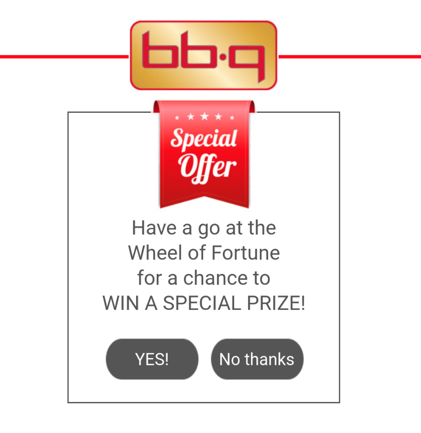
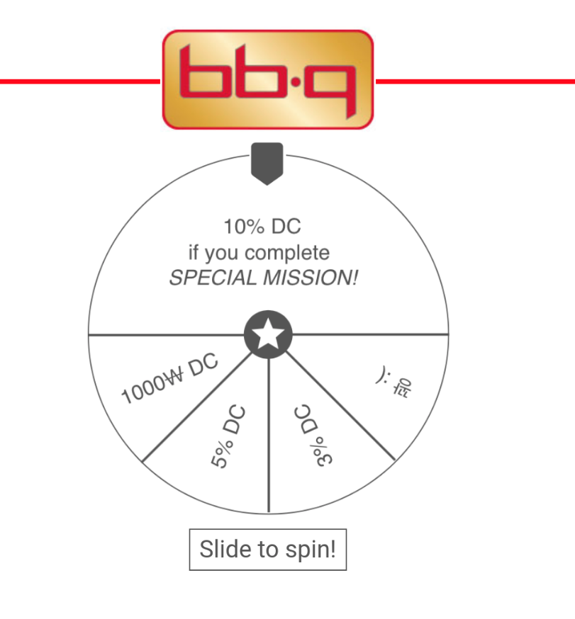
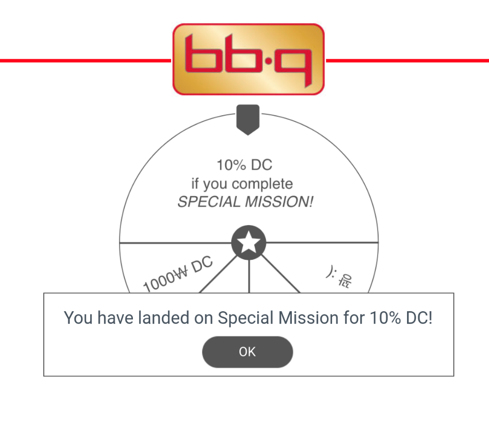
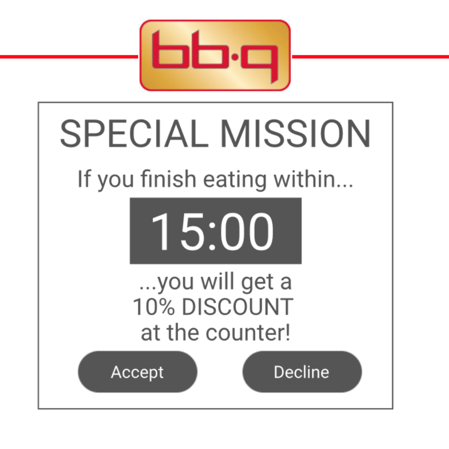
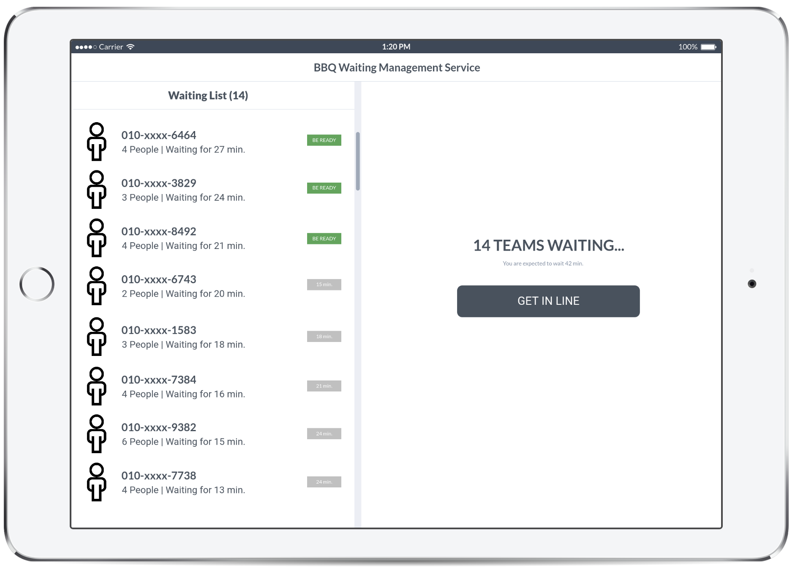
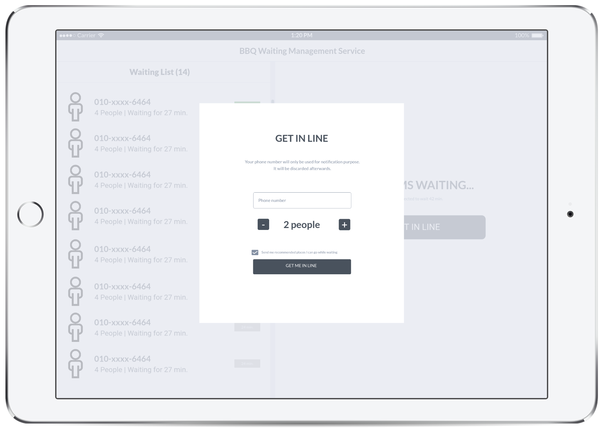
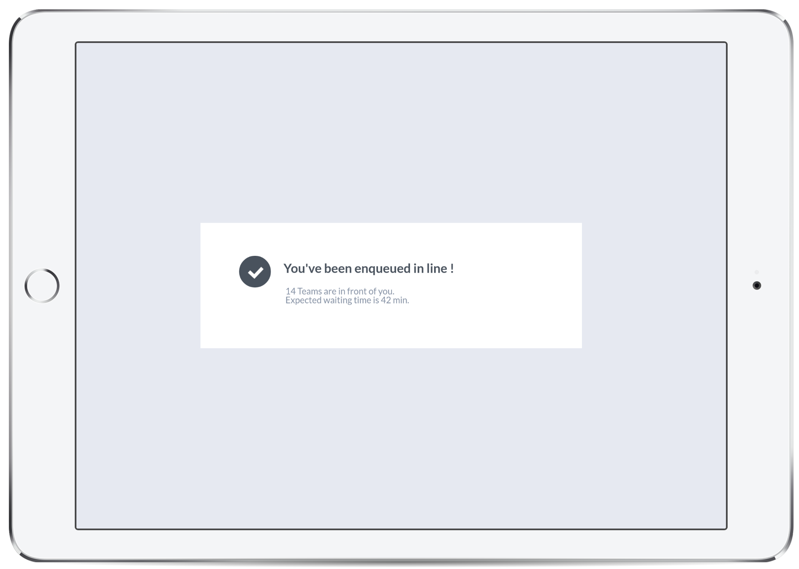
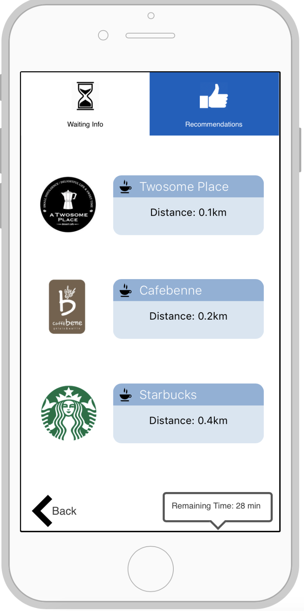
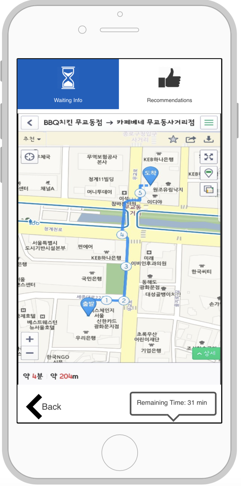

**CS374 Design Project 3: Lo-fi Prototyping**  
**Team JEONSSA**  
20111016 Min Kang  
20121059 SunJae Lee  
20121061 Joon Young Lee  
20121087 Sewon Hong

---

# Lo-fi Prototyping
 
---
## POV

We met several restaurant owners and potential customers who have experienced or have trouble with long waiting line at a busy restaurant. 
We were amazed that one out of two customers leave because of the long waiting, and that customers get very frustrated while waiting when they have to wait indefinitely in a very uncomfortable place. 
It would be game changing to reduce amount of time each customer has to wait, and to provide customers with estimated waiting time with possible resting place.

---
## Tasks

1. Surprise Offer

Customers are randomly propmted with a "Surprise Offer" message with an ipad (or any other portable device) at their table. Customer can choose whether to accept the offer or not. If the cusomer accepts, virtual roulette appears on the screen.  If the customer spins the roulette, he or she recieves a prize depending on which section of roulette it landed on. These sections include several discounts, coupons, and a challenge mission. To encourage fast eating, and give incentives to those who eat fast, in the challenge mission, customer is challenged to eat within a time limit. If the customer succeeds, he or she receives a prize, possibly a discount.

2. Enroll into waiting list

Customers can enroll themselves into a waiting list using an ipad (or any other portable device) at the front desk of the restaurant. On the main screen of the ipad, customers are provided with number of waiting teams, and estimated waiting time. Using this information, user can enroll themselves to waiting list by selecting desired waiting time, and typing in their phone number. 

3. Entertainment place recommendation & Estimated waiting time 

Once customers have registered into the waiting list, they will receive a text message that tells registration has been made successfully, and will provide a website link. The link directs customers to a web page that shows estimated real-time waiting time and remaining waiting team to give customers clear information about how long they should wait. Furthermore, the web page provides nearby entertainment places, sorted by criteria: Cafe, Arcade, and shopping with real-time map that can navigate customers to the particular entertainment place once customer selects the place.

---
## Prototype

### Prototyping tool

Our team chose to use both marvelapp.com and proto.io. The Surprise Offer functionality and Waitlist Enrolling functionality were implemented in marvelapp.com, while the Entertainment place recommendation & Estimated waiting time functionality was done in proto.io.

Both marvelapp.com and proto.io had respective advantages and disadvantages. Marvelapp.com provided a very simple interface for prototyping, allowing us to create actionable areas simply by dragging and clicking, while different screens were hyperlinked to each other, much like a PowerPoint slide - simple and intuitive. owever, one drawback was that not many triggers were available; for example, we would have liked our offer popup to trigger when a specific time period had passed, but marvelapp.com does not support time-based triggers. Also, we would have liked for the wheel-of-fortune portion of the interface to have been able to spin, but marvelapp.com does not support object animations, so we had to hack in an inelegant solution (coalescing many slides to simulate a spinning wheel). Proto.io, on the other hand, supported many object animations, high-level object and construct management, and different triggers were very well implemented. However, it was difficult to make full use of its functionality due to there being so much to fine-tune and manage.

Because the Surprise Offer and Waitlist Enroll functionalities had very simple user flow cases, it was ideal to implement them in marvelapp.com - on the other hand, the Entertainment place recommendation & Estimated waiting time functionality had some complexity in its use case flows and UI, and so it was implemented in proto.io.

### Surprise Offer

* **Design choices**

In addition to the portions mentioned above (special offer having no time based trigger and depending on a hard-coded trigger, and wheel-of-fortune "spin" implemented through hardcoded slides), we were unable to implement a timer which would tick down in realtime, and therefore had to simply represent the timer in static. Also, only one variant from the roulette / wheel-of-fortune category was implemented, because it was infeasible to implement use case flows for all possible variants.

* **Representative screenshots**

 
###### Fig 1: Special Offer pop-up 
 
###### Fig 2: Roulette appears when accepting special offer 
 
###### Fig 3: Result after spinning roulette 
 
###### Fig 4: Can accept or decline mission 

* **Instructions**

Touch "View Menu" to view the restaurant menu, from which you can go back to the previous (home) screen by pressing the upper-right "Back" button. You can also call a waiter by pressing the "Call Waiter" button, on which you will get a notificaion window confirming that a waiter has been called.
The user will then get a special offer to spin a roulette / wheel-of-fortune for a chance to win a prize, which they can choose to accept or decline. Should they accidentally decline, they can make the popup show again by touching an icon, as explained in the prototype (error prevention). Once the roulette / wheel-of-fortune is spun, it lands on the "special mission" category. Again, you can choose to accept or decline through buttons on a popup window. Should you accidentally decline, a popup message confirms your decision (again, error prevention). Should you accept, a timer window appears on the screen.

### Enroll into waiting list

* **Design choices**

* **Representative screenshots**

###### Fig 1: Hi 

###### Fig 2: Hi 

###### Fig 3: Hi 

* **Instructions**

### Entertainment place recommendation & Estimated waiting time

* **Design choices**
We haven't yet decided how we are going to calculate the time remaining. A possible option is reducing time only when a table becomes empty. We will have to further discuss on this matter.

* **Representative screenshots**

 
###### Fig 1: Three categories of recommended entertainment places 
 
###### Fig 2: List of cafes 
 
###### Fig 3: Map showing current location and selected cafe 

* **Instructions**

Touch either 'waiting info' or 'recommendations' on top of the screen. 'waiting info' screen doesn't have any interactions. If user touches 'recommendations', then show categories of entertainments. If user selects a category, in this prototype 'cafe', then a list of cafe appears. After selecting a cafe, a map showing current location and selected cafe will appear. 

---
## Participants

###### KAIST undergraduate Student (P1)
* age: 24
* sex: female
* description: She is a undergraduate student at Korea University who often goes out to eat with his boyfriend. She loves going to famous restaurant in seoul, but had to give up many times becuase of long waiting time.
###### Owner of restaurant at Dunsan (P2)
* age: 32
* sex: male
* description: He is a restaurant owner at Dunsan, Daejeon. He runs a famous restaurant that always has waiting customers. 

###### Office worker (P3)
* age: 30
* sex: male
* description: He is a office worker who lives at Gangnam. He always wanted to go dine at a particular restaurant in Gangnam with his family, but couldn't because his wife hates waiting.

---
## Observation

Task | Observation
 --- | --- 
Surprise Offer | 1. Customer might feel that they get disadvantage when they fail the challenge (P2, high) 2. Customer might miss the surprise offer if there is no effective alert (P1, high) 3. Discount rates are too high (P2, low)  4. Wish there are other options not related to direct discount, for example offering cheap free drinks (P1, medium)
Enroll into waiting list | 5. There is no cancel or go back button when in the get-in-line page (P3, high)
Estimating Waiting time | 6. Wish there is a "view all" button to see all the recommended places at once (P2, P3, medium)  7. Wish the map shows all places, not just the selected one (P1, P3, medium)  8. I wish there are more options other than arcade center, cafe, and shopping. An example might be coin karaoke places. (P3, medium)  9. Wish there was a stronger alarm that tells user how much time left in case user is not looking at phone (P1, P3, high)  10. What is the correlationship between teams remaining and time remaining? 5minutes per team? 10minutes per team? (P1, P3, high)

### Plans for Improvement (order corresponds to the list in table)

1. We could add a text that says there is no disadvantage in failing the challenge.
2. Make a strong alarm. Possible with vibration and sound.
3. Restaurant owner can modify the discount rates anytime.
4. Restaurant owner can modify the options anytime.
5. We modified this issue right away in this prototype. 
6. We could add "view all" button later on.
7. We will implement this idea if possible.
8. Make three criteria more general so that they can include all possible entertainment places.
9. At current stage, there is no better alarm system than text messaging user. We will continue thinking about this issue
10. We will have to implement time calculating algorithm on the later stage.

---
## Paper vs Digital

### types of usability issues

### participant's reaction and expectation

### Implementations from previous feedbacks

From the previous feedbacks from the paper prototype, one of the feedback was that it was confusing to have a 주문하기/상세보기 button in the menu display when it actually isn't one of our functionalities. In this version of prototype, we replaced the menu with one that doesn't have 주문하기/상세보기 buttons because you will have to call the waiter anyways to make an order. Another feedback was to implement other functionalities from story boards such as recommending entertainment places. In this digital prototype, we decided to add a additional tasks such as recommending entertainment places, displaying remaining waiting time/teams, and adding a customer to waiting line. Furthermore, some of our participants from the paper prototype said too many pop-ups during surprise offer makes it confusing. We solved this issue by removing unnecessary popups in this prototype. In addition, because some of participants were confused where to get their prize from special mission, we modified text in the special mission screen to explicitly tell user where they can get their prize. We are still figuring out how and feasibility of other feedbacks such as adding other games besides virtual roulette. 

---
## Studio Reflections

### FEEDBACK SUMMARY
1. Pop-up messages are overlapped so it seems a little bit noisy.
2. Add some confirmation when you decide to accept a challenge.
3. When calling a waiter, show some animation or status or time left for user can save time for unnecessary condition.
4. Users may not know that they should click the BBQ image.

### FEEDBACK REFLECTION
1. We changed it so pop-ups no longer overlap.
2. We added an confirmation message when user accepts challenge.
3. The 'waiter has been called' confirmation message pops up.
4. In our final product, we would like the surprise offer to pop-up after a certain amount of time, but the prototyping tools don't provide such function so we initially made an interaction to the BBQ image. Now, we made the surprise offer pop up after user confirms that waiter has been called, because the user will always have to call the waiter, ensuring that surprise offer will pop up.
