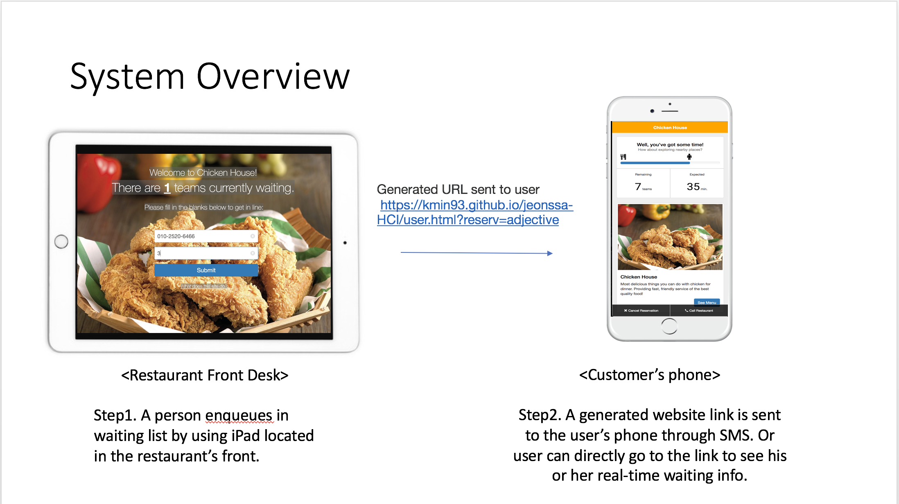
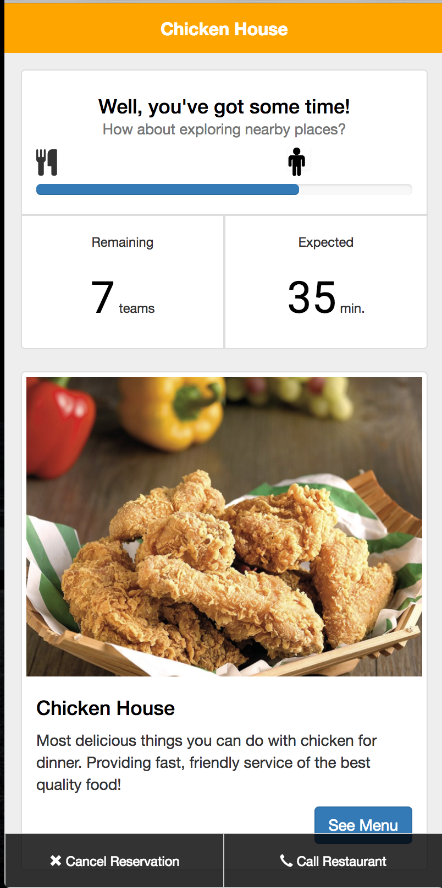
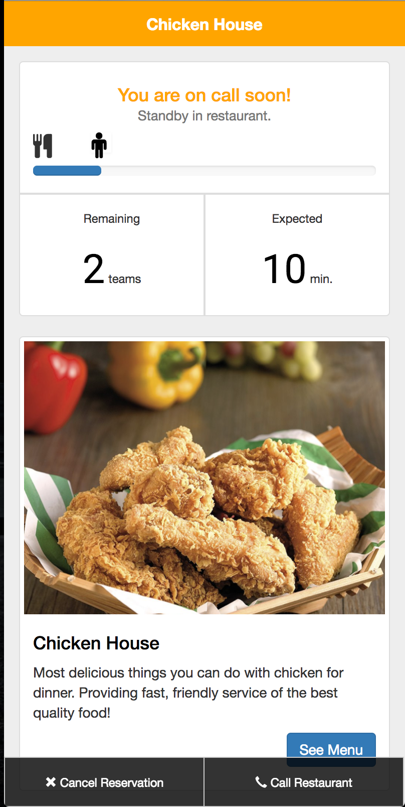
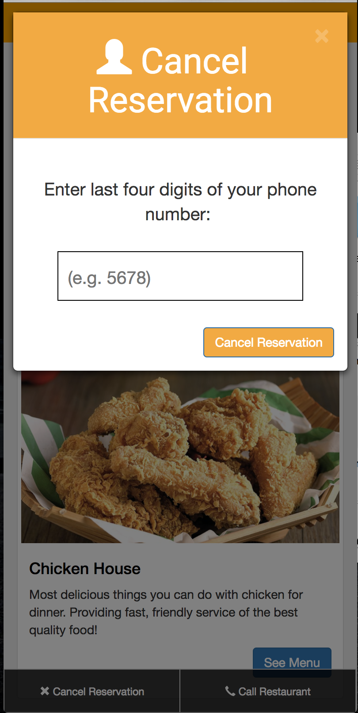

**CS374 Design Project 6: Hi-fi Prototyping**  
**Team JEONSSA**  
20111016 Min Kang  
20121059 SunJae Lee  
20121061 Joon Young Lee  
20121087 Sewon Hong

---

# Hi-fi Prototyping
 
---
## POV
    “A customer waiting for restaurant table needs to feel less frustration
    because one out of two customers tends to leave tired of waiting.”
- User: A customer waiting for restaurant table. 
- Needs: Feel less frustration. 
- Insights: One out of two customers tends to leave tired of waiting. 

We met several restaurant owners and potential customers who have experienced or have trouble with long waiting line at a busy restaurant. 
We were amazed that one out of two customers leave because of the long waiting, and that customers get very frustrated while waiting when they have to wait indefinitely in a very uncomfortable place. 
It would be game changing to reduce amount of time each customer has to wait, and to provide customers with estimated waiting time with possible resting place.

---
## Target Users

Anybody who has experienced waiting for a long time at a restaurant

---
## Tasks
1. Join the waiting list (make a reservation)
 * Fill in the input form (phone number & number of people in team)		
 * Submit
 * Reservation information pops up, giving the url to the user
2. Leave the waiting list (cancel reservation)
 * Click on cancel reservation button in user page
 * Fill in the last four four digits of phone number
 * Submit
 * A page confirming that the reservation has been cancelled shows up
3. Check current position in waiting list (how many people are left)
 * By looking at the slider in user page, the user can get a hint of his relative poisiton in the watiing line

---
## Implementation Notes

### URL of Prototype: <a href="https://kmin93.github.io/jeonssa-HCI/" target="_blank">https://kmin93.github.io/jeonssa-HCI/</a>

### URL of Git repository: <a href="https://github.com/kmin93/jeonssa-HCI" target="_blank">https://github.com/kmin93/jeonssa-HCI</a>

### System Overview

###### Fig 1: System Overview 

### Libraries and frameworks: jQuery, jQuery-mask, Bootstrap, Boostrap-slider, fontawesome

### Lessons from heuristic evaluation

| Feedback | Solution |
| --- | --- |
| No help section to address the site's functionality| Added a Help section to inform first-time users of the site's purpose and functionality|
| Invalid values could be entered in the information input section in main page| Filtered invalid values from information input sections (only numbers allowed), added input rules|
| Copy-pasting URL from popup linked to invalid page|Matched URLs to actual hyperlinks |
| Progress bar in `user.html` could be moved by user | Disabled the "remaining teams" progress bar from being able to be moved by users|
| When cancelling reservation, any random input would register as valid| Match reservation number on cancel, reject otherwise|
|"Call restaurant" button does not work | Implemented call function (in `user.html`)|
|"Cancel" icon doesn't match real world "cancel" icon | Removed "cancel" icon in reservation cancellation popup|

### Representative screenshots:

###### Fig 2: Main screen for enqueuing 

###### Fig 3: Waiting Status 

###### Fig 4: Waiting Status Changed 

###### Fig 5: Canceling Reservation 
---

## Individual Reflections

### Min Kang

<!-- Which part the UI did you directly contribute to?
What were some of the difficulties you faced?
List one useful implementation skill you learned while working on DP5 and DP6. -->

#### Which part the UI did you directly contribute to?

`index.html` page (and corresponding CSS file):
- Base of entire design and layout using Bootstrap
- Entirety of the text portions
- Spanning background image
- Responsive container
- Input fields with example watermarks (placeholders)
- "What does this site do?" anchor linking to modal overlay containing visual aid with help functionality (opens with animation)
- Entirety of visual aid with help functionality
- Initial submit button functionality
- Basic initial parsing of information input for phone number and # of persons  

General:
- Added favicon for the website
- Contribution to progress bar design in `user.html` (initial ideation + make sliding icon a human)

#### What were some of the difficulties you faced?

- Bootstrap overrided or disabled many of the CSS properties that could otherwise have been used normally, so a workaround had to be implemented. For example, I had to set `!important` flags in the CSS file to have sufficiently large enough input boxes. Also, we wanted to implement a clear "X" button to clear the input field if triggered, which is included by default in a search-type input box, but Bootstrap overrided the function. It therefore had to be implemented separately as a whole new object (done by Joon Young)
- Because we wanted to use a background image that spanned the whole page (to represent the restaurant's dishes), it was difficult to choose a suitable font color that would be easily legible. Regardless of the font color, the text was still hard to read in some places. Therefore, I had to define a translucent fill overlay that spanned all the text portions of the main page.
- Even though our main page is designed with a specific and fixed resolution in mind, I wanted to make the main page responsive, in anticipation of all use cases. Aligning the input areas and text areas properly was a chore, but it was especially troublesome having the background image stretch and shrink properly accordingly to different resolutions.
- Initially, my plan was to separate each of the three steps in the helping visual aid into three distinct images, and align three accompanying captions beneath each image accordingly. However, it proved to be impossibly difficult to be able to align each text and image properly, along with the fact that it was difficult to display each of the three steps effectively on the main page. Therefore, I eventually decided to convert the entire visual aid into an rasterized image (along with the accompanying captions),  which could be scrolled like a webtoon in a popup modal window. Although the rasterized captions are not ideal, the scrolling interface of the visual aid would hopefully come naturally to most smartphone users. Again, this had to be implemented separately of the Bootstrap implementation, which already have their own method for modal windows.

#### List one useful implementation skill you learned while working on DP5 and DP6.  
I was able to learn how to properly and effectively create modal windows in HTML and CSS without the aid of an external styling spreadsheet (because I had to implement one independent of the Bootstrap implementation). Through doing so, I was able to better understand the concept of `z-index` since I had to apply and manipulate it directly in the corresponding CSS for the modal window. Also when implementing the modal window, I learned that it was possible to implement animations directly through CSS, which I was able to implement in the opening of my modal window.

---

### SunJae Lee
---
### Joon Young Lee
Which part the UI did you directly contribute to?
* x buttons that clear input in main page
* Input parsing in main page; when typing phone number, '-' is automatically added in right place
* Red warning text showing next to input field in main page when an unacceptable input is submitted. For example if the phone number is left empty or its number of digits is not equal to 11, different warnings that are appropriate to conditions are shown.  
* The entire Reservation information popup
What were some of the difficulties you faced?
* When showing the red warning text, I wasn't sure how 
List one useful implementation skill you learned while working on DP5 and DP6.
* Using Jquery mask library to parse phone number formatting

### Sewon Hong

---
## Studio Reflections

### FEEDBACK SUMMARY
1. Remaining teams and expected waiting time letters are too small
2. Canceled page is not mobile friendly
3. When I get link and I press just OK, how to get in the my reservation page?
4. I think you can merge two UI in waiting page. (running person UI and number UI)
5. Maybe it’s better to have a link to main page in Last page(Cancelled)
6. I think it might be a bad idea to make the URL clickable in the main interface, because people might click on it, while the main screen should stay there in front-desk computer. 
7. No way to go back from reservation cancelled page
8. The number of teams waiting is not immediately apparent to the user. Probably the background picture makes it difficult to see this important message. If i knew there were 10 teams waiting, I might think that is too much waiting time and decide not to go for this.
9. Is typing number when cancelling a reservation for verification? if it  not, it might be annoying.
10. How can I show up - the system pops up a message that I’ve not shown up after few seconds. I’m not sure what I should do after visiting to the restaurant.
11. It would be better if main page be more responsive in mobile view.
12. Providing another link to the user page seems not a good idea in the viewpoint of usability. There’s no point to move into the different page as a user.

13. It is display in large display. So, if user touch the display, it need not narrow Submit button. More thick button.
14. Maybe user want to reserve menu during they waits.
15. Phone number & number of member cancel button is hard to find.
16. When I push “chicken house” in header, nothing is done. (I expected that I can go to home)
17. Some users may insert wrong phone number by mistake. What if add some check phone number by 인증번호 받기
18. It’ll be better to save phone number and use it when canceled.

### FEEDBACK REFLECTION
1. We've made it larger so that it is easier to read.
2. We've made it so it is mobile friendly.
3. In final showcase, our plan is to use a USIM-equipped ipad to show the main page then send a message to mobile phone. Hence, the Reservation Information pop-up is just a mimic of what the message would look like, so can actually be accessed again.
4. They must be separate because main page will be ready in the restaurant entrance, and waiting info page should be accessed by customer's mobile phone.
5. No, because customers should not be able to enque outside the restaurant; our service is not a reservation system that can be done outside the restaurant.
6. As mentioned in 3, the URL is in customer's phone message, so it should be clickalbe.
7. Reservation cancelled page should be a dead-end, once the reservation is cancelled, the user should not be able to enque outside the restaurant.
8. We think it is ok, but we will consider changing picture after more user testing.
9. Yes, it is for verification. We allow the user to only cancel his/her own reservation.
10. The restaurant will remove a customer from waiting list if he shows up, which we will not implement. 
11. We've made it so it is more responsive.
12. Once again, url is included in user's phone message.
13. We've made it thicker
14. We will implement this before final showcase.
15. We've made it so it is easier to spot.
16. The user should not access the main page with phone
17. 인증번호받기 will make it too complicated, the user should type input again.
18. Our system operates in that way.
