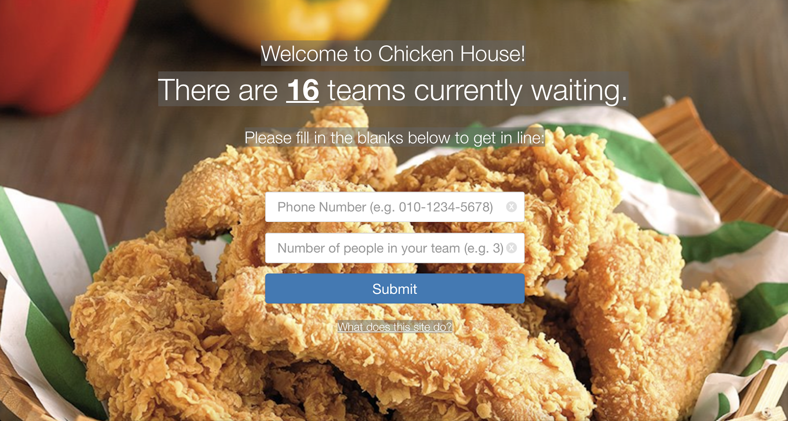
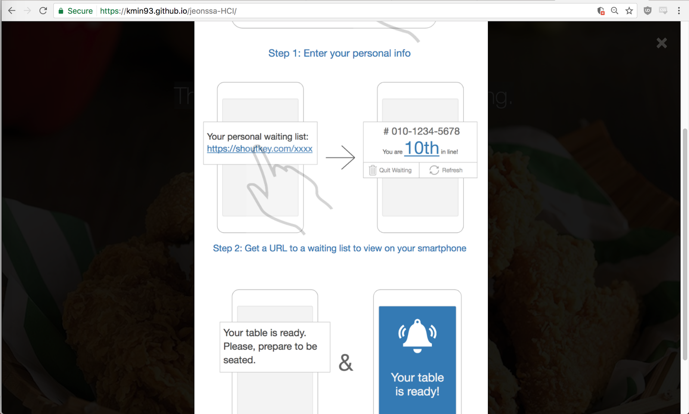

**CS374 Design Project 7: User Testing**  
**Team JEONSSA**  
20111016 Min Kang  
20121059 SunJae Lee  
20121061 Joon Young Lee  
20121087 Sewon Hong

---

## Written Protocol
 
### Preparation and Setting
 
* Web browser: Google Chrome Version 58.0.3029.110 (64-bit) 
* URL: [https://kmin93.github.io/jeonssa-HCI/](https://kmin93.github.io/jeonssa-HCI/)
 
Imagine participants are at a busy restaurant where table is full. There is a line of total four teams trying to register themselves into the waiting list: One participant, and three from the team.
 
Pretend that the testing area is restaurant front desk where tablet PC is located. Tablet PC has following link opened with chrome browser: https://kmin93.github.io/jeonssa-HCI/ . Object is for participants is to get in the line using the given tablet PC. 
 
Our test will use both within subjects, and between subjects method. There are two sessions in the test: First session is have participant at the first of the line . Second session is to have participant at the last of the line. Some participants will do first session first, and some participants will do second session first. 
 
There will be no additional verbal description given to the participants regarding the application itself. Participants should figure out how the system works on their own.

#### Testing environment
Tester prepares tablet pc and a cell phone
Participant will be given a cell phone and pretending it is their own.
Testing will be done in a busy restaurant so that user actually feels he/she want
A place where both the user and the tester feel comfortable and 
quiet enough to conduct an interview
 

### Introduction and informed consent
 
You are invited to take part in a user testing. The results of this test will provide some crucial information as to how we might improve our service. It is your choice if you want to participate in this user testing or not. This form explains both why we are conducting and what will happen during the user testing. This information will help you decide whether you want to participate in our user testing.
 
#### Purpose of the user testing
We are to launch a web-based service that provides estimated waiting time and enables joining/leaving waiting line in busy restaurants, so that customers don’t have to wait inside restaurants. We want to check whether we missed out any important tasks or have any kind of usability issues.  

#### What to expect during test
You will be asked to pretend as if you are to dine at a restaurant where table is full and you have to register yourself to the waiting list. Imagine you arrived at a restaurant front desk, and there is a tablet PC that you can use to join the waiting list.
Spend 5 - 10 minutes using the given tablet PC and your cell phone to successfully dine at the restaurant.
Answer as much as you can to our questionnaires/interview questions
Provide Any suggestions for improvement (if you have any)
 
#### Information to be collected
We will record/capture screens of the tablet PC and the cell phone given.
 
 
### No Tutorial or Training Session
We intentionally did not include a tutorial / training session; the reason being, our service is designed to be installed and distributed across restaurants, where there will be many first-time users (customers). A potential user would have to immediately grasp how to use our system, preferably without any external aid, in a very short span of time (at most, potentially, a waiter or restaurant employee could help with navigating the system). Since high learnability is a key factor of our UI interface, as has been explained, needing a tutorial session would be defeating one of the main purposes of our system.
Instead, our UI interface has an in-built help section, where a new user can learn about how to navigate the interface.

---
# User Testing

## Written Protocol

### Instructions for preparation
Imagine you are at a busy restaurant and there are already 7 teams in waiting line. Pretend that you arrived at the restaurant front desk where tablet PC is located. Tablet PC has following link opened with chrome browser: https://kmin93.github.io/jeonssa-HCI/ . You have to get in the line using this tablet PC. 
 
 
Web browser: user chrome 
URL: https://kmin93.github.io/jeonssa-HCI/

### Testing environment
1. Tester prepares tablet pc
2. User brings his cell phone
3. Testing will be done in a busy restaurant so that user actually feels he/she want
4. A place where both the user and the tester feel comfortable and quiet enough to conduct an interview
 
### Introduction and informed consent:
##### Introduction	
You are invited to take part in a user testing. The results of this test will provide some crucial information as to how we might improve our service. It is your choice if you want to participate in this user testing or not. This form explains both why we are conducting and what will happen during the user testing. This information will help you decide whether you want to participate in our user testing.
 
##### Purpose of the user testing
We are to launch a web-based service that provides estimated waiting time and enables joining/leaving waiting line in busy restaurants, so that customers don’t have to wait inside restaurants. We want to check whether we missed out any important tasks or have any kind of usability issues.  
 
##### What to expect during test
- Spend 5~10 minutes exploring the web like you normally would
- Answer as much as you can to our questionnaires/interview questions
- Provide Any suggestions for improvement (if you have any)
- We will record/capture screens and write notes 
 

### Tutorial or training: 

###### Figure 1: Main screen for enqueuing. 

###### Figure 2: 'What does this site do?' tutorial pop-up. 

##### Tutorial:
We will offer a tutorial in the main page (Figure 1). Once  ‘What does this site do?’ is clicked a tutorial page (Figure 2) will pop up. It will serve the purpose of providing a quick view of the overall mechanism of our service

##### Training session:
- Task list & instruction: What are the tasks participants should perform, and what instruction should they be given? This is another part that should be delivered exactly as written to all participants.
- Recording strategy: How will you record your observations and findings? We advise against video recording, but instead recommend sketches, photos, voice recordings, screen captures, screen recordings, and written notes as you see fit. Also discuss what role members of your team will play in each session: facilitator, observer, and optionally tech person in charge of monitoring if the system is working fine and data is collected properly.
- Questionnaires, Interview questions: After the session, it's a good idea to get qualitative comments about the task experience from participants. In doing so, we suggest preparing a list of questions to ask in advance. For interviews, consider semi-structured format: follow the initial plan you came up with, but ask additional questions based on participants' responses.
- Debrief prompt: After the session, thank your participants and give them a short debrief about the experience and the project.

---
## Session Observations
- Participants are representative?
- Participant information is descriptive and contextual?
- Visual aids (photo or sketch) are added?
- Summary of each session is provided?

---
## Usability Lessons
- 10+ usability issues submitted?
- Are the usability issues described concretely and clearly?
- Organized by task and theme?
- Level of criticality included?
- High-level reflections are thoughtful and insightful?

---
## Plan for Iteration
- Is the plan for improvement reasonable and concrete?
- Are the goals well-justified?

---
## Studio Reflections

### FEEDBACK SUMMARY
1. User testing should be conducted in a more realistic situation, where participants are actually in a restaurant waiting line and in a hurry. The emotional states involved with the situation will affect the satisfaction of ui.
2. Why no training session?
3. Measure the number of trial & errors before successfully using a built in function
4. I recommend testing at least 6 participants to construct a justification of how fast a large number of people can comprehend the functions of UI.

### FEEDBACK REFLECTION
1. Reflected in written protocol - testing environment section; we tested user in busy restaurants
2. Reflected in written protocol - tutorial or training section

