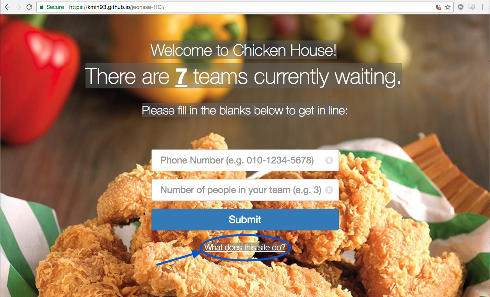
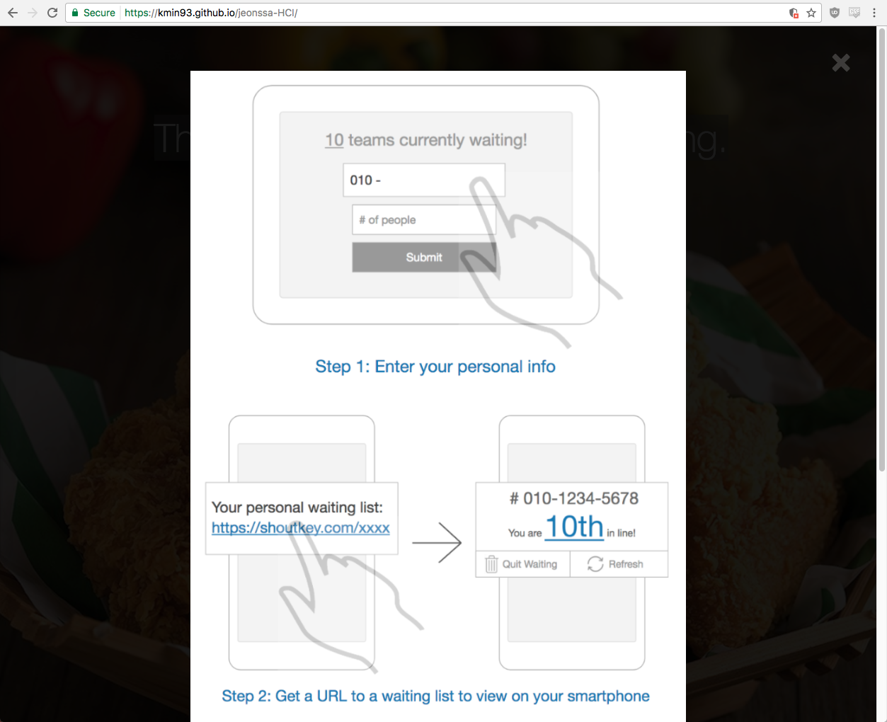

**Team JEONSSA**
20111016 Min Kang  
20121059 SunJae Lee  
20121061 Joon Young Lee  
20121087 Sewon Hong
 
---
 
# DP 7: User Testing
 
## Written Protocol
 
### Preparation and Setting
 
* Web browser: Google Chrome Version 58.0.3029.110 (64-bit) 
* URL: [https://kmin93.github.io/jeonssa-HCI/](https://kmin93.github.io/jeonssa-HCI/)
 
Imagine participants are at a busy restaurant where table is full. There is a line of total four people trying to register themselves into the waiting list: One participant, and three from the team.
 
Pretend that the testing area is restaurant front desk where tablet PC is located. Tablet PC has following link opened with chrome browser: https://kmin93.github.io/jeonssa-HCI/ . Object for participants is to get in the line using the given tablet PC. 
 
Our test will use both within subjects, and between subjects method. There are two sessions in the test: First session is have participant at the first of the line . Second session is to have participant at the last of the line. Some participants will do first session first, and some participants will do second session first. 
 
There will be no additional verbal description given to the participants regarding the application itself. Participants should figure out how the system works on their own.
 
#### Testing environment
Tester prepares tablet pc and a cell phone
Participant will be given a cell phone and pretending it is their own.
Testing will be done in a busy restaurant so that user actually feels he/she want
A place where both the user and the tester feel comfortable and 
quiet enough to conduct an interview
 
 
 
### Introduction and informed consent
 
You are invited to take part in a user testing. The results of this test will provide some crucial information as to how we might improve our service. It is your choice if you want to participate in this user testing or not. This form explains both why we are conducting and what will happen during the user testing. This information will help you decide whether you want to participate in our user testing.
 
#### Purpose of the user testing
We are to launch a web-based service that provides estimated waiting time and enables joining/leaving waiting line in busy restaurants, so that customers don’t have to wait inside restaurants. We want to check whether we missed out any important tasks or have any kind of usability issues.  
 
 
#### What to expect during test
You will be asked to pretend as if you are to dine at a restaurant where table is full and you have to register yourself to the waiting list. Imagine you arrived at a restaurant front desk, and there is a tablet PC that you can use to join the waiting list.
* Spend 5 - 10 minutes using the given tablet PC and your cell phone to successfully dine at the restaurant.
* Answer as much as you can to our questionnaires/interview questions
* Provide Any suggestions for improvement (if you have any)
 
#### Information to be collected
We will record/capture screens of the tablet PC and the cell phone given.
 
#### Task list & instruction
 
##### Join the waiting list (make a reservation)
- Fill in the input form in main page (phone number & number of people in team)
- Submit
- Reservation information pops up, giving the url to the user
- Click on the link to enter user page
 
##### Leave the waiting list (cancel reservation)
- Click on cancel reservation button in user page
- Fill in the last four four digits of phone number
- Submit
- A page confirming that the reservation has been cancelled shows up
 
##### Check current position in waiting list (see how many people are left)
By looking at the slider in user page, the user can get a hint of his relative position in the waiting line
 
#### Recording Strategy
 
##### Techniques for recording
**Screen captures**: In case user has hard time figuring out what this page does, 
capture the screen for later discussion.
**Screen recording**: Record user’s screen and inputs for greater insight.
**Written notes**: Take notes on any meaningful actions by the user.
 
##### Role
- Facilitator: Min Kang
- Observer 1: SunJae Lee
- Observer 2:  Joon Young Lee
- Observer 3 / Tech person:  Sewon Hong
 
#### Survey / Interview questions
 
|#|Survey Questions|
|---|---|
|1|Is the ‘What does this site do’ link in the main page easy to spot?|
|2|Is the white text in main page easy to read? If not, what makes it difficult to read?|
|3|Is the input warning text in main page easy to read? If it isn’t, what makes them difficult to read?|
|4|Did you find the waiting line infographic helpful to get a sense of where you are in the line?|
|5|Are the cancel reservation/call buttons in user page large enough?|
 
|#|Interview Questions|
|---|---|
|1|What did you think of the background picture in main page? |
|2|Did you find ‘what does this site do’ helpful? Did the site function as you expected?|
|3|How easy or difficult was it for you to join/leave waiting line?|
|4|Did you feel like you should be able to go back after cancelling your reservation?|
|5|Are there any other features that you wish existed?|
|6|Was there anything confusing? If so, what? Any suggestions to make it less confusing?|
 
 
 
#### Debrief Prompt
 
Thank you for participating in this session. 
This project that you have just tested is a web application to relieve some frustration of having to wait tediously for a long time when dining at a famous or crowded restaurant. We first started this project based on the question of “How might we make waiting time in a restaurant more meaningful?” As one of our solutions, we decided to make an online system that automatically informs customers of their estimated waiting time so that customers can leave the restaurant and do other meaningful tasks instead of waiting in a restaurant meaninglessly.
The one that you have just tested is prototype of our project, and we will be modifying and improving this prototype based on the feedback you have given to us.
Thank you for participating in our project.
 
 
### No Tutorial or Training Session
We intentionally did not include a tutorial / training session; the reason being, our service is designed to be installed and distributed across restaurants, where there will be many first-time users (customers). A potential user would have to immediately grasp how to use our system, preferably without any external aid, in a very short span of time (at most, potentially, a waiter or restaurant employee could help with navigating the system). Since high learnability is a key factor of our UI interface, as has been explained, needing a tutorial session would be defeating one of the main purposes of our system.
Instead, our UI interface has an in-built help section, where a new user can learn about how to navigate the interface.
 
 
 
#### In-built Help Section
 
---
 
 
###### Figure 1: Main Page, accentuated “What does this site do?” link 

---

 
###### Figure 2: In-build help section 
 
---
 
We offer an in-build help section in the main page. Once  __“What does this site do?”__ is clicked a tutorial page (figure 2) will pop up. It will serve the purpose of providing a quick view of the overall mechanism of our service.
 
## Session Observations
We presented our prototype to total six participants. We mostly recruited KAIST peers for observation due to several reasons. First, our application is designed in English so we needed participants who could understand English without difficulty. Secondly, we had limited time and human resources. Recruiting KAIST peers was a feasible option in finding English-speaking participants within limited time.
 
 
###### KAIST undergraduate Student

* Age: 23
* Sex: female
* How did we recruit: Close club member
* Description: She is a KAIST undergraduate student who often goes out to eat with his boyfriend. Both she and her boyfriend is well known foodie, and has lots of experience waiting in a restaurant
* Uniqueness: Since she has many experience waiting in a restaurant, she gave many insights on whether our application can actually work in the reality.
* Summary: 
For the first session, we positioned her at the first in the line. When she first looked at the main page, she clicked on “what does this site do” link to see the help page. She registered successfully without error in 48 seconds. However, she did not notice that the cell phone received a text message. After informed about the text message, she directly went into the link. She did not have hard time noticing what user page does and shows. In cancelling the reservation, it took 11 seconds with one trial & error.
	For the second session, we positioned her at the last in the line. Using her experience from the first session, it only took 15 seconds to register, noticed text message right away, and took 8 seconds for cancellation..  
 
###### KAIST graduate student
* Age: 24
* Sex: male
* How did we recruit: Asked him to help while eating dinner together
* Description: He is a KAIST graduate student in the computer science department. He hates waiting in a restaurant, and mostly leave the restaurant if table is full.
* Uniqueness: Since he is a computer science major graduate student, and has many experience developing applications, he helped us find bug, and functional issues.
* Summary: 
	For the first session, we positioned him at the last in the line. While waiting, he watched person in front of him registering. He did not click on the “what does this site do,” but took only 13 seconds to register without error. He noticed the text message, and had good grasp on what user page does. It took 7 seconds for him to cancel the reservation.
	For the second session, he had one error while registering - typing in wrong phone number - and took 20 seconds to register, and took 6 seconds to cancel. 
 
 
 
 
###### KAIST graduate Student

* Age: 24
* Sex: male
* How did we recruit: a close friend
* Description: He is a KAIST graduate student in the physics department. He likes to try out new restaurants and friends about them. 
* Uniqueness: He has a quick grasp when using new apps, and likes to criticize. He gave us some valuable criticisms that lead to usability lessons.
*Summary: For the first session, we positioned him at the first in the line. He first looked at the main page and without clicking “what does this site do”, he submitted form right away without any trial & errors. However, the default keyboard setting of ipad was in english rather than numbers and special characters, so it took a few seconds to switch between keyboard input modes. It took him a total of 20 seconds to submit. Luckily he noticed that he received a text message and entered user page. It took him 10 seconds to cancel reservation. 
	For the second session, we positioned him at the last in the line. Using his experience from the first session, it only took 12 seconds to register and 7 seconds to cancel reservation.
 
###### KAIST undergraduate Student

* Age: 24
* Sex: male
* How did we recruit: Roommate of one of our team members.
* Description: He is a KAIST ungraduate student in the Bio & Brain engineering department. He often whines about how he had to wait long time uncomfortably for the restaurant at Gangnam whenever he goes to see his girlfriend at Seoul.
* Uniqueness: He really liked our application, and was very excited about it. 
*Summary: For the first session, we positioned him at the first in the line. He first looked at the main page and without clicking “what does this site do”, he submitted form right away without any trial & errors. However, the default keyboard setting of ipad was in english rather than numbers and special characters, so it took a few seconds to convert to It took him 20 seconds to submit When she first looked at the main page, she clicked on “what does this site do” link to see the help page. She registered successfully without error in 48 seconds. However, she did not notice that the cell phone received a text message. After informed about the text message, she directly went into the link. She did not have hard time noticing what user page does and shows. In cancelling the reservation, it took 11 seconds with one trial & error.
	For the second session, we positioned her at the last in the line. Using her experience from the first session, it only took 15 seconds to register, noticed text message right away, and took 8 seconds for cancellation..  
 
###### KAIST undergraduate Student
* Age: 24
* Sex: male
* How did we recruit: a close friend
* Description: He is a KAIST graduate student in the physics department. He likes to try out new restaurants and friends about them. 
* Uniqueness: He has a quick grasp when using new apps, and likes to criticize. He gave us some valuable criticisms that lead to usability lessons.
*Summary: For the first session, we positioned him at the first in the line. He first looked at the main page and without clicking “what does this site do”, he submitted form right away without any trial & errors. However, the default keyboard setting of ipad was in english rather than numbers and special characters, so it took a few seconds to switch between keyboard input modes. It took him a total of 20 seconds to submit. Luckily he noticed that he received a text message and entered user page. It took him 10 seconds to cancel reservation. 
	For the second session, we positioned him at the last in the line. Using his experience from the first session, it only took 12 seconds to register and 7 seconds to cancel reservation.
## Usability Lessons
10+ usability issues submitted?
Are the usability issues described concretely and clearly?
Organized by task and theme?
Level of criticality included?
High-level reflections are thoughtful and insightful?
#Usability lessons are derived from questionnaires/interview questions and user testing observations.
|#|Issues|Theme|Level of Criticality|
|---|---|---|---|
|1|In the reservation page, the "See Menu" button does not work.|Consistency & standards|Major: high priority fix|
|2|Currently, the progress bar in the reservation page serves no purpose than to simulate functionality. It does not accurately reflect how many teams are actually waiting.|Consistency & standards|Major: high priority fix|
|3|On Android phones, the confirmation page for reservation cancellation is not mobile-friendly.|Consistency & standards|Major: high priority fix|
|4|In the main page, when using the X button to clear the input field, the input field loses cursor focus (cannot type anymore).|Consistency & standards|Minor: low priority fix|
|5|In the main page, keyboard input (on iPad) shows QWERTY keyboard, not numbers.|Consistency & standards|Minor: low priority fix|
|6|When a user makes a mistake when submitting his/her phone number, they have to go through the entire submission process again.|Consistency & standards|Minor: low priority fix|
|7|Placeholders in the main page seems too verbose, making it hard to grasp what information to input instantly. |Flexibility & Efficiency|Minor: low priority fix|
|8|Cannot contact restaurant from the reservation cancellation page.|Flexibility & Efficiency|Minor: low priority fix|
|9|It is hard to close the “Cancel Reservation” pop-up window - the X button to close is hard to see.|Visibility of system status|Major: high priority fix|
|10|The "What does this site do?" link is hard to see.|Aesthetic & minimalist design|Major: high priority fix|
|11|When entering a wrong number when cancelling a reservation, the page alert is unfriendly.|Error reporting, diagnosis, and recovery|Cosmetic: need not be fixed|
 
### High-level Reflections
Tough. At first we thought writing code and implementing the actual application was the biggest chunk of the DP project. But we realized user testing is as tough as implementing. We had to put a lot of time and effort before, during, as well as after the user testing.
Hard judgement call. We had hard time judging what and when usability issues arise. Usability issues arouse in many forms. Many issues were explicitly addressed through “Thinking aloud”. However some delicate issues had to be captured by observing small reactions such as face expressions, body gestures and instinctive sounds.
Wrong hypothesis. During designing and development, we had put series of design choices based on our own hypothesis. We believed that these choices would be good for users. However, some design choices turned out that 
 
 
## Plan for Iteration
|#|Goals|
|1|Implement a View Menu function in the reservation page.|
|2|Update the progress bar function in the reservation page to reflect actual remaining teams left, based on the database info.|
|3|Change reservation cancellation page to be mobile-friendly (for Android).|
|4|Enlarge the close button for the “Cancel Reservation” pop-up window in the user reservation page, as well as letting the window close if the user taps outside the pop-up window|
|5|Enlarge the “What does this site do?” link, possibly adjust font style and color|
|6|Change the X button (input field clear) in the main page to maintain focus in the input field when activated|
|7|When the input field is selected in the main page, make only a number pad show up on the iPad, and not a QWERTY keyboard|
|8|When user inputs phone number, add a confirmation phase to check whether user inputted correct info|
|9|Make the input field placeholders more succinct and concise (to the point)|
|10|Add some functionality to the reservation cancellation confirmation page, such as the ability to call the restaurant|
|11|On wrong phone number input when cancelling a reservation, change the page alert to an in-page visual alert.|
 
## Studio Reflections
|#|Feedback|Reflections|
|---|---|---|
|1|User testing should be conducted in a more realistic situation, where participants are actually in a restaurant waiting line and in a hurry. The emotional states involved with the situation will affect the satisfaction of the UI.|* One participant was tested in a busy restaurant. |
|2|Will there be no training session?|*Addessed in “No Tutorial or Training Session” section*| 
|3|To evaluate usability,  users’ number of trial & errors before successfully using a built-in function should be measured|*Addressed in Session Observations summary|
|4|At least 6 participants should be tested to construct a justification of how fast a large number of people can comprehend the functions of UI.| *We tested 6 participants
